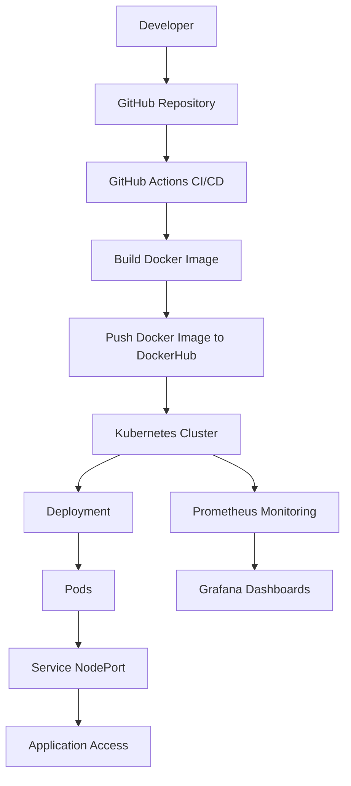

# DevOps Kubernetes Project

Este projeto demonstra o deploy de uma aplicação containerizada utilizando Kubernetes em uma instância AWS EC2.

O objetivo foi praticar conceitos importantes de DevOps como containerização, orquestração de containers e exposição de serviços dentro de um cluster Kubernetes.

---

## Tecnologias utilizadas

- AWS EC2
- Kubernetes (K3s)
- Docker
- Nginx
- Linux
- Git
- GitHub

---
## DevOps Pipeline Architecture

## Como a Arquitetura Funciona

1. O desenvolvedor envia o código para o repositório no GitHub.
2. O GitHub pode executar pipelines de CI/CD usando GitHub Actions.
3. Uma imagem Docker é construída a partir da aplicação.
4. A imagem é enviada para um repositório de imagens (DockerHub).
5. O Kubernetes puxa essa imagem e realiza o deploy no cluster.
6. Os Pods executam a aplicação dentro do cluster Kubernetes.
7. Um Service do tipo NodePort expõe a aplicação para acesso externo.
8. O Prometheus coleta métricas do ambiente e o Grafana exibe dashboards de monitoramento.

## Deploy da aplicação

Criar deployment:

kubectl create deployment nginx-deployment --image=nginx

Verificar pods:

kubectl get pods

Expor aplicação:

kubectl expose deployment nginx-deployment --type=NodePort --port=80

Verificar serviço:

kubectl get svc

---

## Acesso à aplicação

Após expor o serviço, a aplicação pode ser acessada pelo navegador utilizando o IP público da instância EC2 e a porta NodePort.

Exemplo:

http://100.26.42.81:31351

Isso exibirá a página padrão do Nginx rodando dentro do Kubernetes.

---

## Objetivo do projeto

Este projeto foi criado para praticar:

- Deploy de aplicações em Kubernetes
- Estrutura de um cluster Kubernetes
- Exposição de serviços com NodePort
- Integração entre Docker, Kubernetes e AWS

---
## Autora

Rayane Santana
